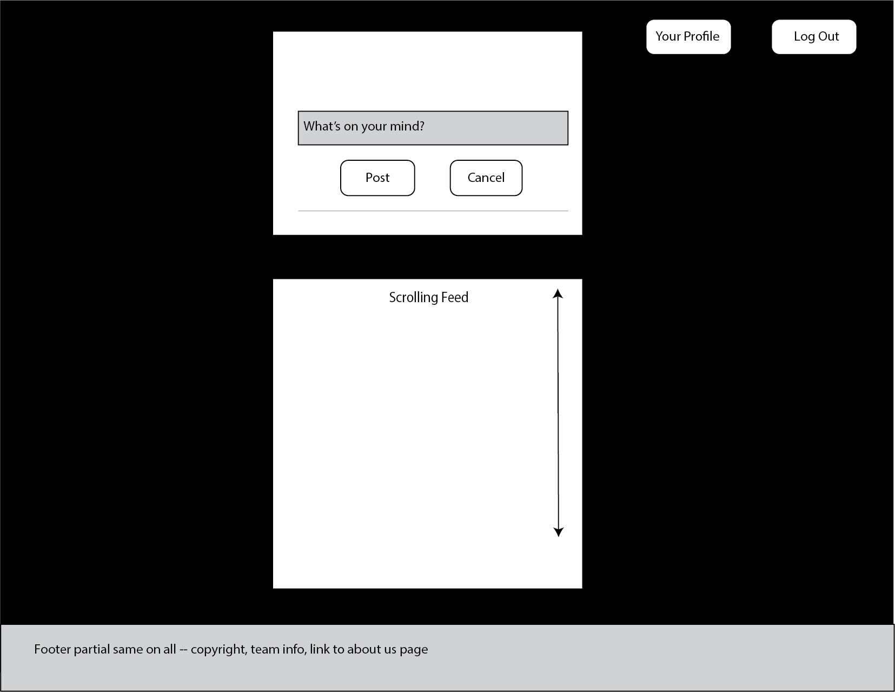
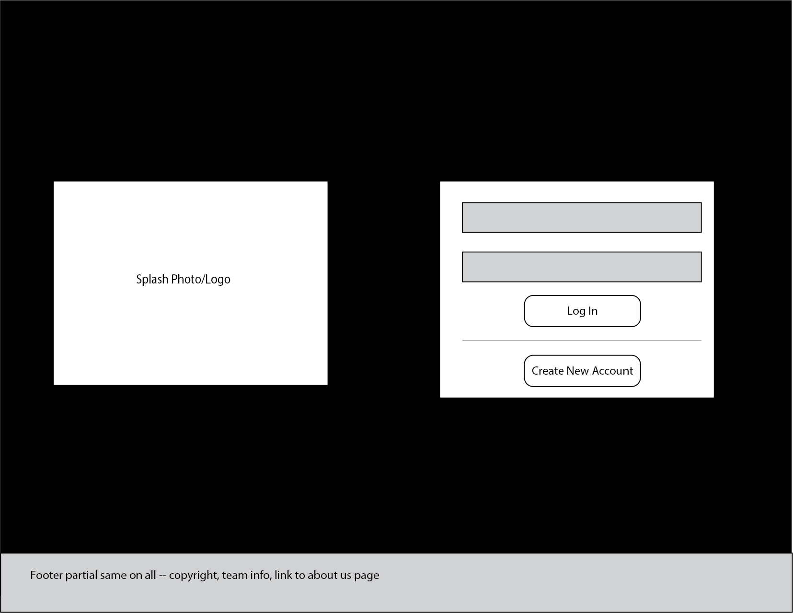
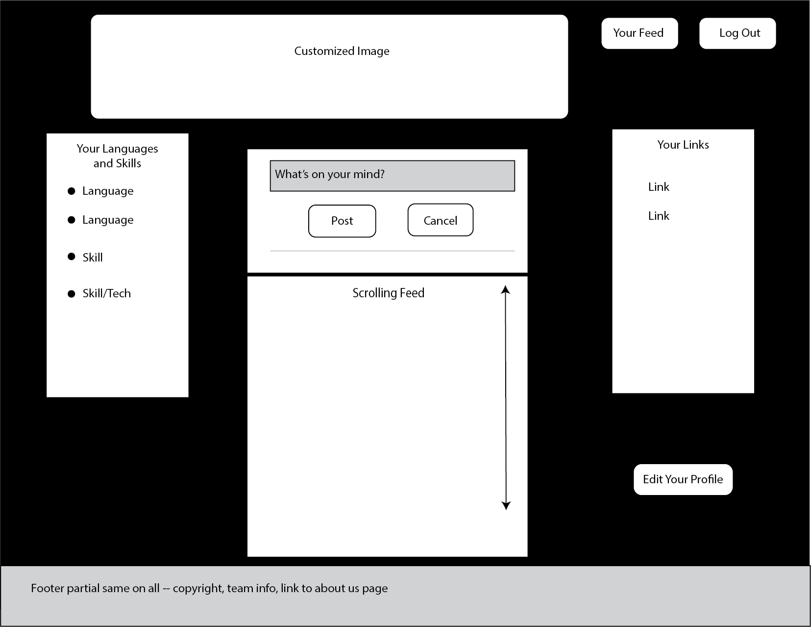
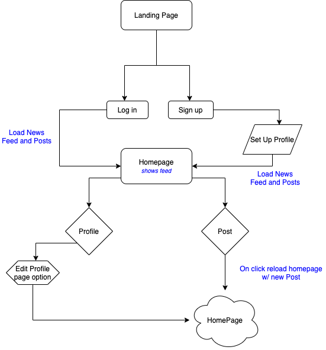
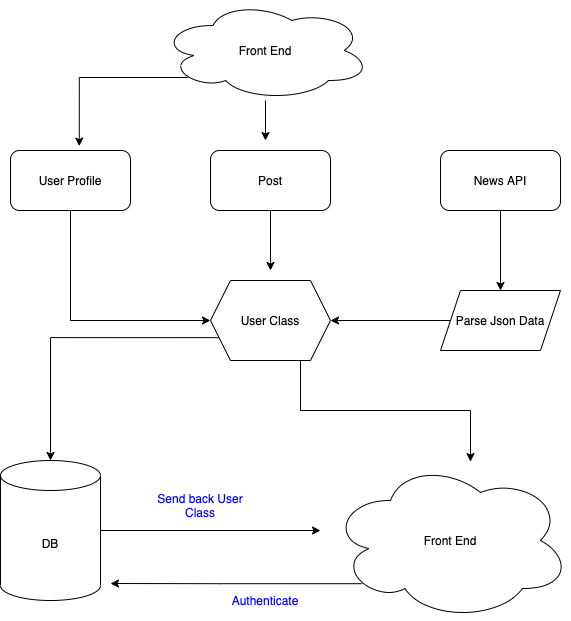

# 401-Python-Finale
A REACT front end with a Django backend culminates our Code Fellows learning

Team members: Ashley Casimir, Bhagirath Bhatt, Kim Damalas, Nick Dorkins

------------
Wireframes:

--------------

------------
User Stories:

------------

Contained at [Trello Link](https://trello.com/b/JSQhGSxY/talk-dev-to-me)

-----------
Domain models (front and back end):

---------
Software Requirements:

[Software Requirements Doc](./requirements.md)