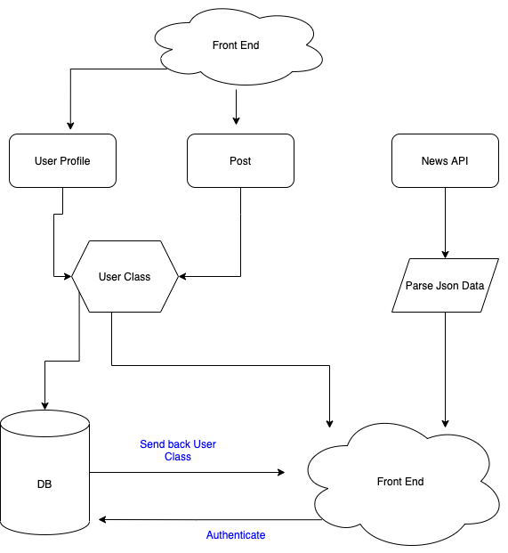

# Team TDTM
There are so many different kinds of social media platforms out there. Why can't devs have one??? Talk Dev to Me is a mix of discord,facebook and dial up AOL. A place where Devs can connect and meet other Devs.

A REACT front end with a Django backend

Team members: Ashley Casimir, Bhagirath Bhatt, Kim Damalas, Nick Dorkins

------------
Wireframes:

--------------

------------
User Stories:

------------

Contained at [Trello Link](https://trello.com/b/JSQhGSxY/talk-dev-to-me)

-----------
Domain models (front and back end):

---------
Software Requirements:

[Software Requirements Doc](./requirements.md)

-------------
Database Requirements:

- One table to store user profile information
    - username
    - password
    - languages/skills
    - links

- One table to store user posts
    - title
    - text information
    - owned by
    

